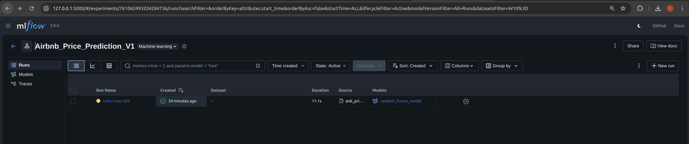
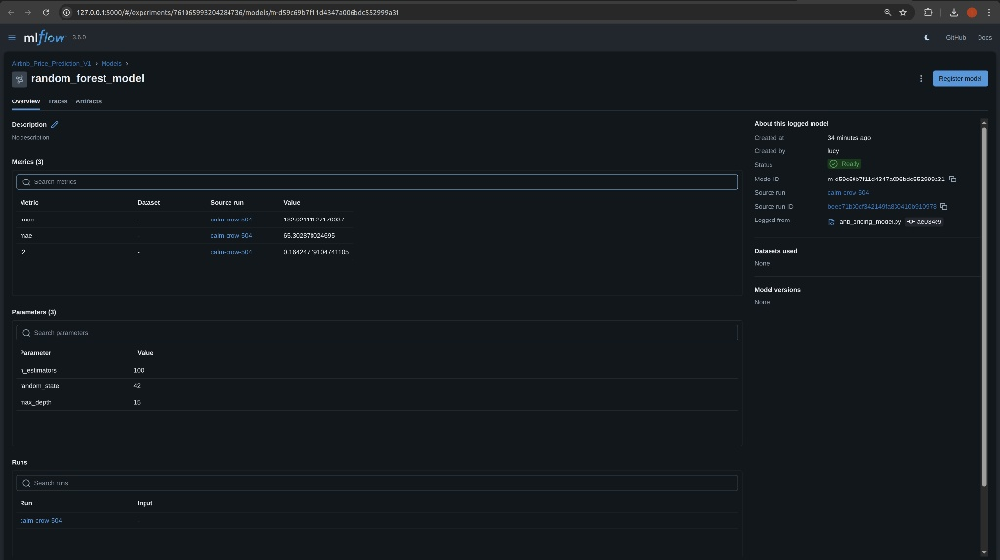

# StayWise Airbnb Price Prediction

## 1. Project Overview
**Context:** StayWise aims to enhance its pricing system by predicting the optimal nightly price for new Airbnb listings. This project builds a machine learning pipeline to predict prices based on location, room type, and reviews.

**Objective:**
- Retrieve data from AWS S3 (implemented using `boto3`).
- Clean and preprocess data (handling outliers and missing values).
- Train a Random Forest Regressor.
- Track experiments using **MLflow**.

## 2. Repository Structure
- `airbnb_pricing.py`: The core script for data processing, training, and logging.
- `requirements.txt`: Python dependencies.
- `.gitignore`: Excludes large data files and MLflow artifacts from version control.
- `mlruns/`: (Local only, excluded from Git) Stores MLflow experiment logs.

## 3. Setup & Execution

### Prerequisites
- Python 3.8+
- AWS Credentials (configured via `aws configure` or env vars)

### Installation
1. Clone the repository.
2. Install dependencies:
   ```bash
   pip install -r requirements.txt

### Running the Model

Update the `BUCKET_NAME` variable in `airbnb_pricing.py` to your actual S3 bucket.

Run the script:

```bash
python airbnb_pricing.py
```

### Viewing Results (MLflow)

To inspect experiments:

```bash
mlflow ui
```

Open `http://localhost:5000` in your browser and navigate to the `Airbnb_Price_Prediction_V1` experiment.

## 4. Key Insights & Observations

Based on the experiment results recorded in MLflow:

* **Model Performance:** The Random Forest model achieved an RMSE of 182.52 and an MAE of 65.30. This indicates that, on average, the model's price predictions deviate by about $65 from the actual listing price.

* **R-Squared:** The R2 Score is 0.18, suggesting that the current features explain about 18% of the variance in price.

* **Data Quality:**

  * `reviews_per_month` contained missing values which were imputed with 0.
  * `price` column contained outliers (e.g., $0 values) which were filtered out during preprocessing.

* **Future Improvement:** To improve the R2 score, we recommend:

  * Hyperparameter tuning (increasing `n_estimators` or `max_depth`).
  * Adding more features (e.g., parsing text from the listing name or description).

## 5. MLflow UI Screenshots

1. **Experiment Overview**

2. **Model Metrics & Registry**
